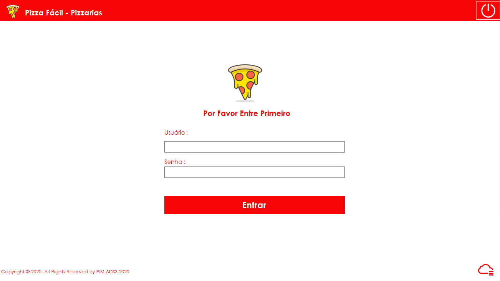
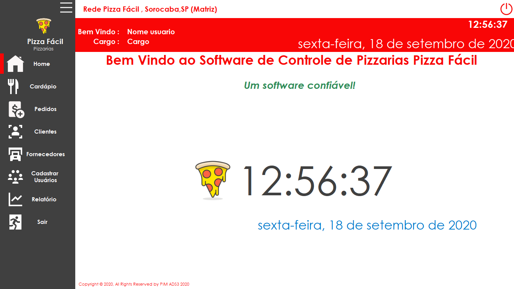
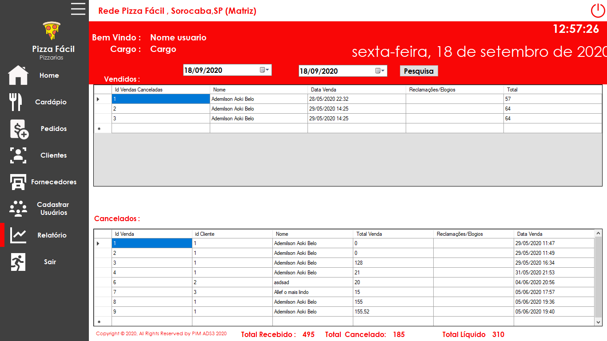

# Por que?
Proejto realizado através de uma necessidade academica, e adiquirir conhecimentos em POO e C#.Executado com liguagem C# utilizando winforms, usando banco de dados na nuvem aws, com o banco MySql.

# Sistema 
Realiza Cadastro/Atualização/Listagem/Exclusão  de Produtos e Cliente e Registro de Vendas.Gerar Relatório de Vendas. 

- Telas do Sistema.

Através das telas proporcionam o objetivo dos sistema.

# Como rodar essa aplicacao?
Essa aplicacao foi construida na IDE Visual Studio 2019, para conseguir rodar aplicacao basta clonar através do comando 

git clone : https://github.com/AdemilsonAoki/Pim2020Beta2.0_WinForms.git

